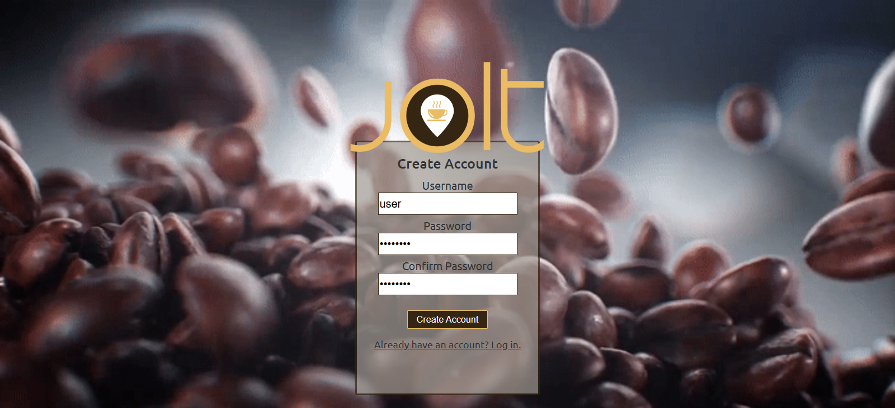
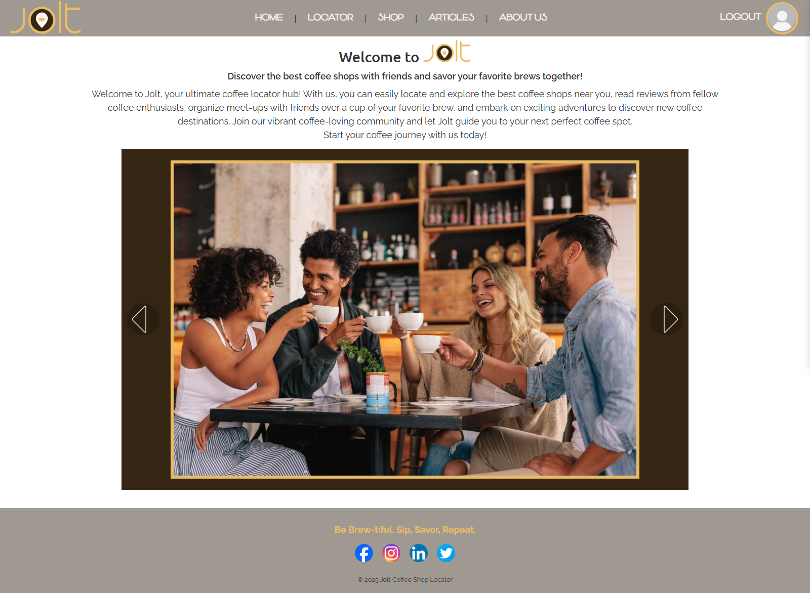
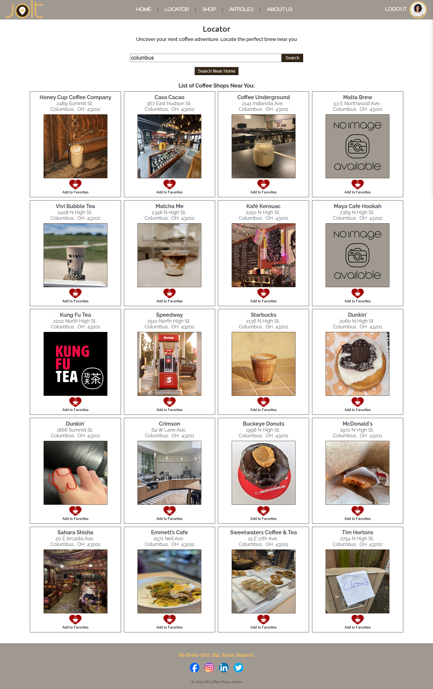
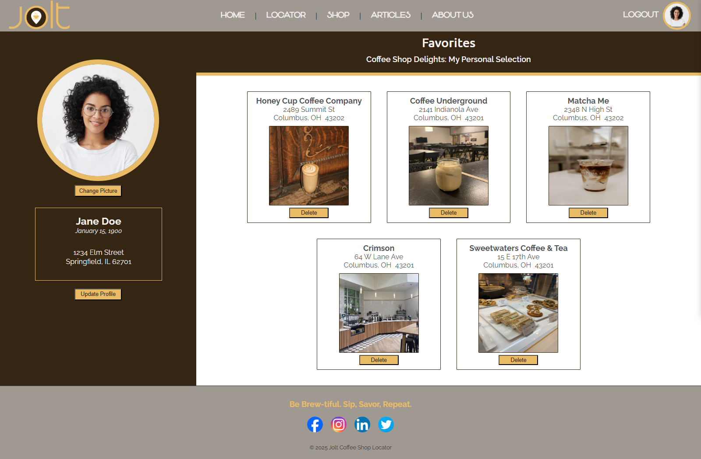

# Jolt Coffee Shop Locator

### Full-Stack Business Discovery Application

Jolt is a full-stack business discovery application that centralizes local business information into a unified user experience.

The application demonstrates business systems analysis, API integration, relational database design, and full-stack web development by combining external business data with authenticated user features, personalized favorites, and structured workflows.

Originally developed as a collaborative project, the application was later redesigned and expanded to improve application architecture, user workflows, and overall functionality.

---

## Project Overview

Jolt helps users discover and evaluate local coffee shops by consolidating business information from external data sources into a single application.

Users can:

- Search nearby coffee shops
- View real-time business information
- Save favorite locations
- Manage personalized user profiles

All within a single, streamlined user experience.

---

## Key Features

### Business Discovery

- Search coffee shops using Yelp Fusion API data
- View business details and location information
- Browse local businesses through a centralized interface

### User Management

- Secure user authentication
- User profile management
- Personalized favorites functionality

---

## System Architecture

### Frontend

- Vue.js
- JavaScript
- HTML5
- CSS3
- Axios

### Backend

- Java
- Spring Boot
- RESTful API
- JDBC

### Database

- PostgreSQL

### External Services

- Yelp Fusion API

---

## Technical Implementation

The application follows a traditional client-server architecture with a Vue.js frontend communicating with a Spring Boot REST API backed by PostgreSQL.

- Designed intuitive user interfaces focused on usability and efficient business discovery
- Integrated Yelp Fusion API to aggregate real-time business data
- Implemented user authentication, profile management, and favorites functionality
- Implemented RESTful communication between frontend and backend systems
- Designed PostgreSQL database structures to support user and application workflows
- Applied full-stack development practices using Java, Spring Boot, Vue.js, and PostgreSQL

---

## Technology Stack

| Category | Technologies |
|-----------|-------------|
| Frontend | Vue.js, JavaScript, HTML5, CSS3, Axios |
| Backend | Java, Spring Boot, JDBC |
| Database | PostgreSQL |
| APIs | Yelp Fusion API |
| Tools | Git, GitHub, IntelliJ IDEA |

---

## Screenshots

The following screenshots demonstrate the primary user workflows throughout the application.

### Login Page

Secure user authentication for personalized features.

---

### Home Page

Introduces the application and primary navigation.

---

### Search Results

Displays nearby coffee shops retrieved from the Yelp Fusion API.

---

### Shop Details

Displays shop details and available user actions.

---

### Profile Management

Allows users to create and manage their profile information.

---

### Favorites

Displays saved coffee shops for authenticated users.

---

## Future Enhancements

- Responsive layout for tablets and mobile devices
- User reviews and ratings
- Enhanced search filtering
- Interactive mapping functionality
- Search history and recommendations

---

## Author

**Jennifer Curtis**

Business Systems Analyst | Full-Stack Developer

🌐 **Portfolio:** [jennifercurtis.me](https://jennifercurtis.me)

💼 **LinkedIn:** [linkedin.com/in/jcurtisdeveloper](https://linkedin.com/in/jcurtisdeveloper)

💻 **GitHub:** [github.com/craftycurtis05](https://github.com/craftycurtis05)

