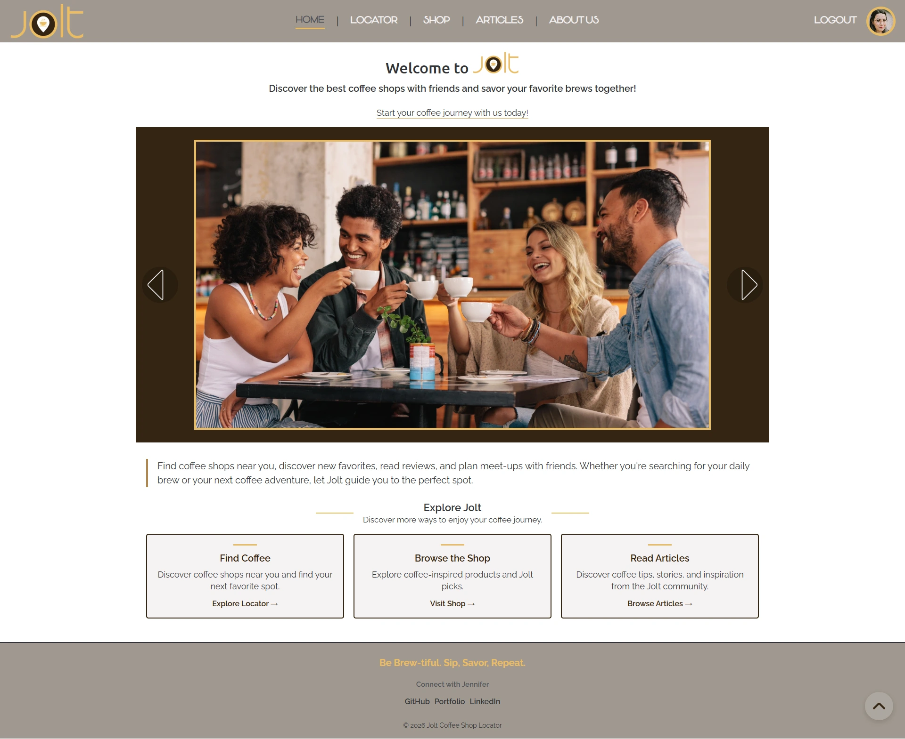
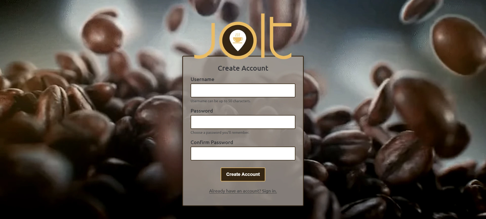
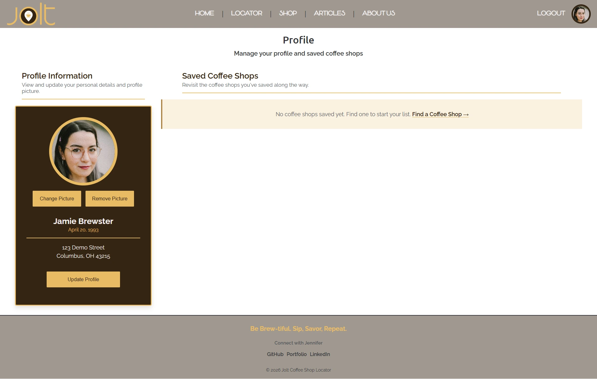
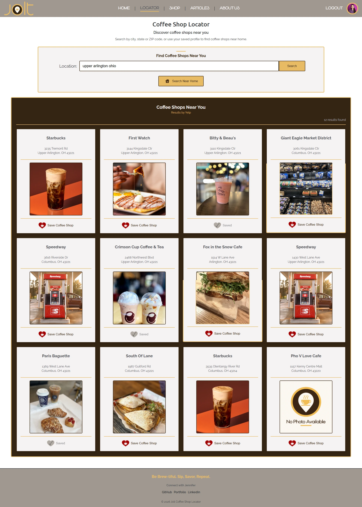
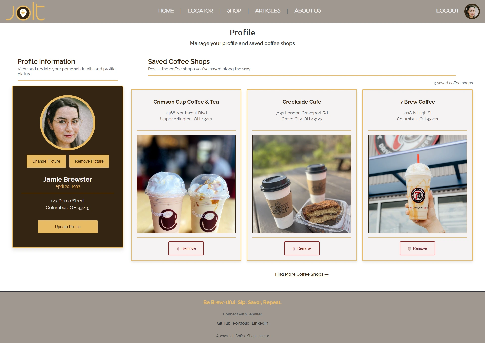
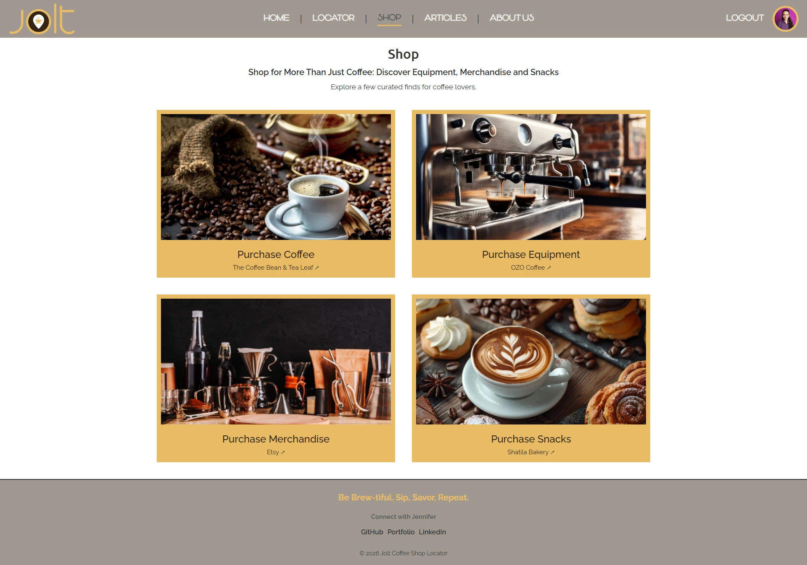
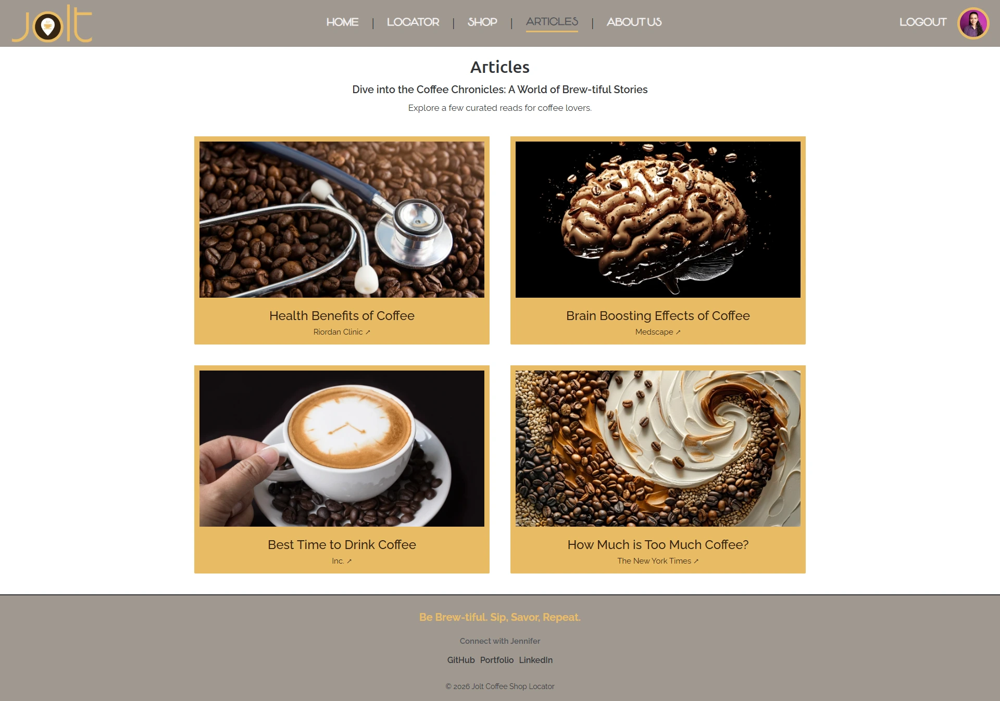
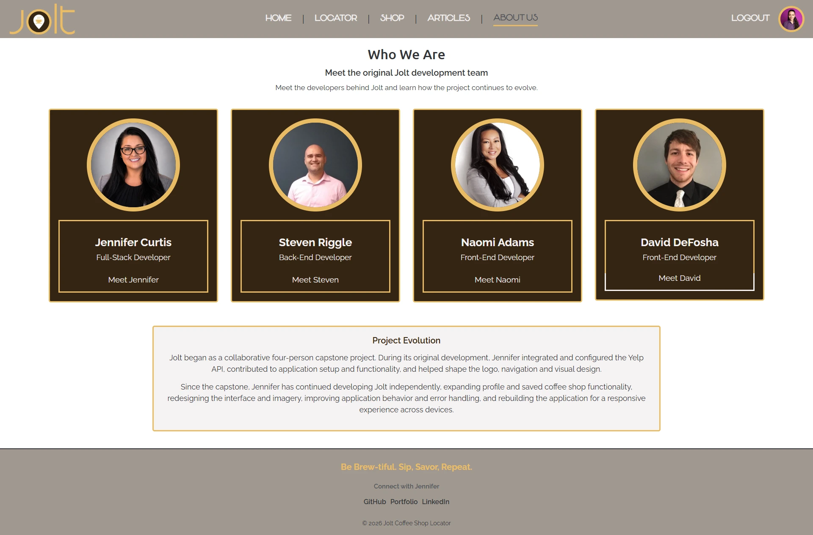

# Jolt Coffee Shop Locator

### Full-Stack Coffee Shop Discovery Application

Jolt is a full-stack web application that helps users discover local coffee shops, view real-time business information, save coffee shops, and manage a personalized user profile.

Originally developed as a collaborative capstone project during the Tech Elevator Full-Stack Java Bootcamp, Jolt was later independently redesigned and expanded. I continued working on the application after the bootcamp to improve its organization, user experience, security, testing, and overall functionality.

The version in this repository reflects the continued development completed after the original capstone project.

---

## Project Evolution

Jolt began as a collaborative four-person capstone project focused on helping users find nearby coffee shops using real-time business data from the Yelp Fusion API.

During the original development, I integrated and configured the Yelp API, contributed to application setup and functionality, and helped shape the logo, navigation, and visual design.

After completing the bootcamp, I continued developing Jolt independently. I redesigned the user interface, expanded profile and saved coffee shop functionality, improved application behavior and error handling, strengthened database and authentication security, added automated testing, and rebuilt the application for a responsive experience across devices.

This project represents one of my first full-stack applications and has given me the opportunity to continue applying what I have learned as my development skills have grown.

---

## Project Overview

Jolt brings coffee shop discovery and personalized user features together in one application.

Users can:

- Register and log in to a secure account
- Search for coffee shops by city, state, or ZIP code
- Search near a saved home location
- View real-time business information from the Yelp Fusion API
- Save coffee shops to a personalized list
- Create and update a user profile
- Upload and manage a profile picture

The application uses a Vue.js frontend, a Java and Spring Boot REST API, and a PostgreSQL database.

---

## Key Features

### Coffee Shop Discovery

- Search for coffee shops by city, state, or ZIP code
- Search near the home location stored in a user profile
- Retrieve current business information through the Yelp Fusion API
- View business names, addresses, images, and additional Yelp information
- Open directions or view additional business information through Yelp
- Save coffee shops directly from search results

### User Authentication

- User registration and login
- BCrypt password hashing
- JWT-based authentication
- Protected user-specific application features
- Authenticated requests between the Vue frontend and Spring Boot backend
- Session-expiration handling for protected application workflows

### Saved Coffee Shops

- Save coffee shops returned through Yelp searches
- View saved coffee shops from a personalized list
- Remove previously saved coffee shops
- Prevent duplicate saved coffee shops for the same user
- Restrict saved coffee shop management to the authenticated account

### User Profiles

- Create a personalized profile
- Update existing profile information
- Use a saved home location for coffee shop searches
- Maintain profile information separately for each authenticated user
- Track profile form completion
- Protect profile data using the authenticated user's account

### Profile Images

- Upload a profile picture
- Replace an existing profile picture
- Remove a profile picture
- Validate supported image types
- Store profile image data in PostgreSQL

### User Experience

- Responsive layouts across desktop, tablet, and mobile screen sizes
- Keyboard-visible focus states for interactive elements
- Reduced-motion support
- Mobile-friendly touch targets
- Loading and processing states for asynchronous actions
- Application-wide notifications and user feedback
- Clear empty, error, and validation states
- Custom not-found page and navigation behavior

---

## Independent Development

Following the original capstone project, I continued developing Jolt independently as my development skills grew.

Some of the changes and additions include:

- Redesigned the application's user interface and responsive layouts
- Reorganized the project and removed duplicate backend files
- Expanded profile management functionality
- Expanded saved coffee shop functionality and duplicate prevention
- Added profile image upload, replacement, and removal
- Added application-wide user notifications and loading states
- Improved application error handling and user feedback
- Improved authenticated user data protection
- Added session-expiration handling
- Moved sensitive application values to environment variables
- Improved PostgreSQL database roles and application permissions
- Hardened the local database setup process
- Added automated DAO, controller, security, and integration testing
- Improved CORS configuration for local and deployed environments
- Improved keyboard accessibility, reduced-motion support, and mobile touch targets
- Continued refining application copy, navigation, and overall usability

These changes allowed me to continue working with the same application while applying concepts I learned after the original capstone was completed.

---

## System Architecture

Jolt follows a traditional client-server architecture.

```text
Vue.js Frontend
       |
       | HTTP / REST
       v
Spring Boot Backend
       |
       | JDBC
       v
PostgreSQL Database

Spring Boot Backend
       |
       | HTTPS
       v
Yelp Fusion API
```

### Frontend

- Vue.js
- JavaScript
- HTML5
- CSS3
- Axios
- Vue Router
- Vuex

### Backend

- Java 11
- Spring Boot
- Spring Security
- RESTful API
- Spring JDBC
- JdbcTemplate
- JWT Authentication
- Maven

### Database

- PostgreSQL

### External Services

- Yelp Fusion API

---

## Technical Implementation

The Vue frontend communicates with the Spring Boot backend through RESTful HTTP requests.

The backend handles authentication, user-specific application data, database access, profile images, and communication with the Yelp Fusion API.

Some of the main technical concepts used throughout Jolt include:

- RESTful frontend and backend communication
- JWT authentication
- BCrypt password hashing
- Spring Security
- PostgreSQL relational database design
- DAO-based database access with JdbcTemplate
- Foreign key relationships and database constraints
- User-specific data access
- Multipart image uploads
- External API integration
- Environment-based application secrets
- Automated backend testing
- Responsive frontend design
- Accessibility-focused user interface behavior

---

## Database

Jolt uses PostgreSQL to store application and user-specific data.

The main database tables include:

```text
users
favorites
profile
image
```

User-owned records are connected to the application's users through foreign key relationships.

The database also includes constraints that support application rules, including preventing the same coffee shop from being saved more than once by the same user.

Jolt uses separate PostgreSQL roles for database ownership and normal application access. The Spring Boot application connects with a limited application account rather than the PostgreSQL administrator account.

---

## Security

Jolt uses Spring Security and JWT authentication to protect user-specific application functionality.

Security-related features include:

- BCrypt password hashing
- Stateless JWT authentication
- Protected backend endpoints
- Authenticated user lookup
- User-specific saved coffee shops, profiles, and profile images
- Environment variables for passwords, JWT secrets, and API keys
- Restricted application database permissions
- CORS configuration for approved frontend origins

The backend determines the current user from the authenticated request rather than accepting a user ID from the frontend for protected data operations.

---

## Testing

Jolt currently includes **98 passing automated backend tests** covering database, controller, authentication, security, and integration behavior.

Testing includes:

- User DAO integration tests
- Favorites DAO integration tests
- Profile DAO integration tests
- Image DAO integration tests
- Authentication controller tests
- Coffee search controller tests
- Favorites controller tests
- Profile controller tests
- Image controller tests
- JWT token tests
- JWT filter tests
- User details service tests
- Security utility tests
- Authentication and access-denied handler tests
- Web security integration tests

DAO integration tests use a separate PostgreSQL test database so database behavior can be tested without modifying the normal development database.

Before the final release, the application was also checked with frontend linting, a production frontend build, and manual testing across desktop, tablet, and mobile workflows.

---

## Technology Stack

| Category | Technologies |
| --- | --- |
| Frontend | Vue.js, JavaScript, HTML5, CSS3, Axios |
| Backend | Java 11, Spring Boot, Spring Security, JDBC |
| Database | PostgreSQL |
| Authentication | JWT, BCrypt |
| API | Yelp Fusion API |
| Testing | JUnit, Spring Boot Test, Spring Security Test |
| Tools | Git, GitHub, Maven, IntelliJ IDEA |

---

## Screenshots

The following screenshots demonstrate Jolt after the independent redesign and continued development.

### Home

Explore Jolt's main features from a responsive landing page designed to make coffee shop discovery simple and easy to navigate.



---

### Create Account

Create a secure Jolt account to access personalized features, with clear validation and feedback throughout the registration process.



---

### Profile Management

Create and manage personal information and a profile picture used across Jolt's personalized features.



---

### Coffee Shop Locator

Search by city, state, or ZIP code—or use a saved home location—to find nearby coffee shops with real-time business information from Yelp.



---

### Saved Coffee Shops

Save coffee shops from search results and manage them from a personalized list tied to the authenticated user.



---

### Jolt Shop

Browse a responsive collection of Jolt merchandise that extends the application's visual identity beyond its core coffee shop features.



---

### Coffee Articles

Explore coffee-related articles through a responsive card-based layout designed for quick browsing and easy navigation.



---

### About Jolt

Meet the original development team and see how Jolt evolved from a collaborative capstone into an application I continued redesigning and expanding independently.



---

## Project Structure

```text
jolt-coffee-shop-locator/
├── java/
│   ├── database/
│   ├── src/
│   │   ├── main/
│   │   └── test/
│   ├── pom.xml
│   └── README.md
├── vue/
│   ├── public/
│   ├── src/
│   │   ├── assets/
│   │   ├── components/
│   │   ├── router/
│   │   ├── services/
│   │   ├── store/
│   │   └── views/
│   ├── package.json
│   └── README.md
├── screenshots/
├── .env.example
├── load-env.sh
└── README.md
```

The Java and Vue directories contain additional README files with more information about each side of the application.

---

## Running Jolt Locally

Jolt requires:

- Java 11
- PostgreSQL
- Node.js and npm
- A Yelp Fusion API key

Sensitive values are stored in a local `.env` file and are not committed to the repository.

An example environment file is included:

```text
.env.example
```

Copy the example file to `.env` and provide the required local values.

### Load Environment Variables

From the project root:

```bash
source load-env.sh
```

### Start the Backend

From the Java directory:

```bash
cd java
./mvnw spring-boot:run
```

The backend runs locally on:

```text
http://localhost:9000
```

### Start the Frontend

In a second terminal:

```bash
cd vue
npm install
npm run dev
```

The Vue development server runs locally on:

```text
http://localhost:5173
```

Additional setup information is available in the Java and Vue README files.

---

## Environment Variables

The root `.env.example` file documents the private environment values required by the application.

```env
DB_PASSWORD=
DB_ADMIN_PASSWORD=
JWT_BASE64_SECRET=
YELP_API_KEY=
```

The actual `.env` file should remain local and should never be committed or shared publicly.

---

## Live Demo

Jolt is deployed and available at:

**Live Application:** https://jolt.jennifercurtis.me

Visitors can create their own account to explore the full registration and authentication workflow or use the prepared demo account for immediate access.

### Demo Account

```text
Username: joltdemo
Password: DemoPass123
```

The demo account includes a completed sample profile, profile image, and saved coffee shops to demonstrate Jolt's personalized features.

### Production Deployment

The deployed application uses:

- **Frontend:** Vue.js hosted on Namecheap
- **Backend:** Spring Boot REST API hosted on Render
- **Database:** PostgreSQL hosted on Neon
- **External API:** Yelp Fusion API

Production configuration and sensitive credentials are managed through environment variables and are not stored in the repository.

> The backend is hosted on Render's free service tier and may require a short startup period after extended inactivity.

---

## Future Enhancements

Jolt is intentionally maintained as one of my earlier full-stack projects, but there are several features that could be added in the future:

- Enhanced coffee shop search filtering
- Interactive map integration
- User reviews and ratings
- Search history
- Personalized coffee shop recommendations

---

## Author

**Jennifer Curtis**

Business Systems & Technology Professional | Full-Stack Developer

**Portfolio:** https://jennifercurtis.me

**LinkedIn:** https://linkedin.com/in/jcurtisdeveloper

**GitHub:** https://github.com/CraftyCurtis05
